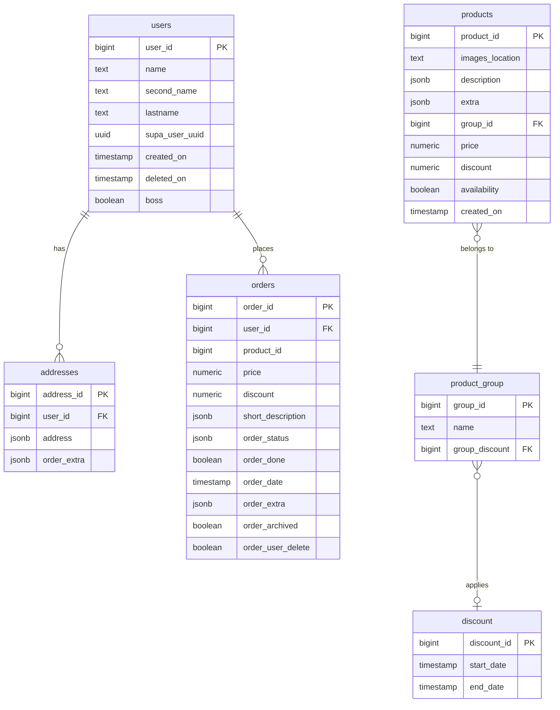

# Database

## ER Diagram

> `orders.product_id` has **no foreign key** by design — product details can change after an order is placed. A snapshot is stored in `orders.short_description`.

---

## Tables

### `users`

| Column | Type | Notes |
|--------|------|-------|
| `user_id` | bigint PK | App-level identifier — always use this, not the UUID |
| `name` | text | |
| `second_name` | text | |
| `lastname` | text | |
| `supa_user_uuid` | uuid | Links to `auth.users.id`; kept on auth user deletion |
| `created_on` | timestamp | Default `now()` |
| `deleted_on` | timestamp | Nullable — soft delete |
| `boss` | boolean | Admin flag; default `false` |

Populated automatically by the `on_auth_user_created` trigger (see [Triggers](#triggers)).

---

### `addresses`

| Column | Type | Notes |
|--------|------|-------|
| `address_id` | bigint PK | |
| `user_id` | bigint FK → `users` | Cascade delete |
| `address` | jsonb | `{ street, city, postal_code }` |
| `order_extra` | jsonb | Extra delivery notes for this address |

---

### `products`

| Column | Type | Notes |
|--------|------|-------|
| `product_id` | bigint PK | |
| `images_location` | text | Supabase Storage path |
| `description` | jsonb | `{ name, brief_info, info }` |
| `extra` | jsonb | `{ expire: "YYYY-MM-DD", … }` |
| `group_id` | bigint FK → `product_group` | |
| `price` | numeric | |
| `discount` | numeric | Nullable |
| `availability` | boolean | Set to `false` automatically when expired |
| `created_on` | timestamp | Default `now()` |

---

### `orders`

| Column | Type | Notes |
|--------|------|-------|
| `order_id` | bigint PK | |
| `user_id` | bigint FK → `users` | |
| `product_id` | bigint | No FK — intentional snapshot pattern |
| `price` | numeric | Price at time of order |
| `discount` | numeric | Discount at time of order |
| `short_description` | jsonb | `{ name, brief_info }` snapshot |
| `order_status` | jsonb | `{ current_status: "…" }` |
| `order_done` | boolean | Default `false` |
| `order_date` | timestamp | Default `now()` |
| `order_extra` | jsonb | Notes, delivery preferences |
| `order_archived` | boolean | Default `false` |
| `order_user_delete` | boolean | User has requested hiding this order |

**Order status values** (Bulgarian UI strings):

| Value | Meaning |
|-------|---------|
| `Чакаща` | Pending |
| `Потвърдена` | Confirmed |
| `В обработка` | Processing |
| `Изпратена` | Shipped |
| `Доставена` | Delivered |
| `Отказана` | Cancelled |
| `Върната` | Returned |

---

### `product_group`

| Column | Type | Notes |
|--------|------|-------|
| `group_id` | bigint PK | |
| `name` | text | |
| `group_discount` | bigint FK → `discount` | Nullable |

---

### `discount`

| Column | Type | Notes |
|--------|------|-------|
| `discount_id` | bigint PK | |
| `start_date` | timestamp | |
| `end_date` | timestamp | |

---

## Triggers

### `on_auth_user_created`
Fires **after insert on `auth.users`**. Calls `public.handle_new_user()`, which inserts a row into `public.users` using `raw_user_meta_data` fields (`name`, `second_name`, `lastname`) passed during `signUp`.

### `trigger_check_product_expiry`
Fires **before insert or update on `products`**. If `extra->>'expire'` is a past date, sets `availability = false` immediately.

### Scheduled job (`pg_cron`)
Runs `update_expired_products()` daily at midnight — marks any product whose `extra->>'expire'` has passed as unavailable.

---

## Row-Level Security (RLS)

RLS is enabled on all tables. Access is checked via the helper `public.is_boss()`, which returns `true` when the current auth user has `boss = true` and is not soft-deleted.

### Summary

| Table | Anon | Auth user | Boss |
|-------|------|-----------|------|
| `users` | — | Own row (select, update) | All rows |
| `addresses` | — | Own rows (CRUD) | All rows (select) |
| `products` | Read all | Read all | Full CRUD |
| `orders` | — | Own rows (select, insert, update) | All rows (select, update) |
| `discount` | Read all | Read all | Full CRUD |
| `product_group` | Read all | Read all | Full CRUD |

### Storage (`products` bucket)

| Operation | Who |
|-----------|-----|
| SELECT | Public (anon) |
| INSERT / UPDATE / DELETE | Authenticated users |

---

## Migrations

| File | Description |
|------|-------------|
| `20260225200853_create_users_table.sql` | `users` table |
| `20260225200910_create_addresses_table.sql` | `addresses` table |
| `20260225200915_create_discount_table.sql` | `discount` table |
| `20260225200919_create_product_group_table.sql` | `product_group` table |
| `20260225200925_create_products_table.sql` | `products` table |
| `20260225200942_create_orders_table.sql` | `orders` table |
| `20260226200247_auth_rls_trigger.sql` | Auth trigger, `is_boss()`, all RLS policies |
| `20260226211314_create_products_storage_bucket.sql` | Storage bucket + policies |
| `20260227184635_auto_expire_products.sql` | Expiry trigger + pg_cron job |
